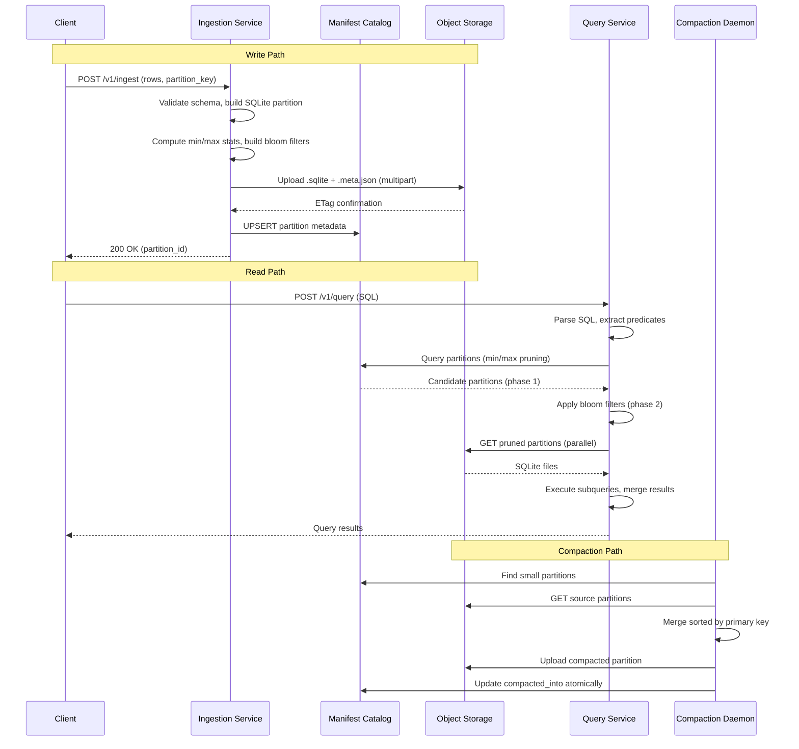

# Design Document: Project Arkilian

## Overview

Project Arkilian is a distributed analytical database implemented in Go that uses immutable SQLite micro-partitions (8-16MB) stored in object storage. The system provides Snowflake-like compute/storage separation with a stateless query federation layer.

The architecture consists of four main components:

1. **Ingestion Service (arkilian-ingest)**: Accepts batch writes, generates SQLite partitions, uploads to S3
2. **Manifest Catalog (manifest.db)**: SQLite-based metadata store tracking all partitions
3. **Query Federation Layer (arkilian-query)**: Parses SQL, prunes partitions, executes queries in parallel
4. **Compaction Daemon (arkilian-compact)**: Merges small partitions, handles garbage collection

### Design Principles

1. **Immutability**: Partitions are never modified after creation; compaction creates new files
2. **Partition Autonomy**: Each SQLite file is self-contained with its own indexes
3. **Metadata-Driven Pruning**: Bloom filters + min/max stats eliminate >99% of I/O
4. **Write Isolation**: Writers operate on disjoint partition keys (no distributed locking)
5. **Eventual Consistency**: No distributed transactions; embrace eventual consistency

## Architecture

```
┌──────────────────────────────────────────────────────────────────────────────┐
│                              Client Applications                              │
│                         (HTTP/gRPC API Consumers)                            │
└─────────────────────────────────┬────────────────────────────────────────────┘
                                  │
        ┌─────────────────────────┼─────────────────────────┐
        │                         │                         │
        ▼                         ▼                         ▼
┌───────────────┐         ┌───────────────┐         ┌───────────────┐
│   arkilian-   │         │   arkilian-   │         │   arkilian-   │
│    ingest     │         │    query      │         │   compact     │
│   (Writers)   │         │  (Readers)    │         │  (Background) │
└───────┬───────┘         └───────┬───────┘         └───────┬───────┘
        │                         │                         │
        │    ┌────────────────────┼────────────────────┐    │
        │    │                    │                    │    │
        ▼    ▼                    ▼                    ▼    ▼
┌──────────────────────────────────────────────────────────────────┐
│                        Manifest Catalog                          │
│                        (manifest.db)                             │
│  ┌─────────────────────────────────────────────────────────────┐ │
│  │ partitions: partition_id, object_path, min/max stats, ...   │ │
│  └─────────────────────────────────────────────────────────────┘ │
└──────────────────────────────────┬───────────────────────────────┘
                                   │
                                   ▼
┌──────────────────────────────────────────────────────────────────┐
│                     Object Storage (S3/GCS)                      │
│  ┌─────────────────┐  ┌─────────────────┐  ┌─────────────────┐   │
│  │ events_20260205 │  │ events_20260205 │  │ events_20260206 │   │
│  │ _001.sqlite     │  │ _001.meta.json  │  │ _001.sqlite     │   │
│  │ (12.4 MB)       │  │ (98 KB)         │  │ (14.2 MB)       │   │
│  └─────────────────┘  └─────────────────┘  └─────────────────┘   │
└──────────────────────────────────────────────────────────────────┘
```

### Component Interaction Flow



## Components and Interfaces

### Package Structure

```
arkilian/
├── cmd/
│   ├── arkilian-ingest/     # Ingestion service binary
│   │   └── main.go
│   ├── arkilian-query/      # Query service binary
│   │   └── main.go
│   └── arkilian-compact/    # Compaction daemon binary
│       └── main.go
├── internal/
│   ├── partition/           # Partition generation and management
│   │   ├── builder.go       # SQLite partition builder
│   │   ├── metadata.go      # Metadata sidecar generation
│   │   └── partition.go     # Partition types and interfaces
│   ├── manifest/            # Manifest catalog operations
│   │   ├── catalog.go       # Catalog CRUD operations
│   │   ├── schema.go        # SQL schema definitions
│   │   └── pruning.go       # Min/max based pruning
│   ├── bloom/               # Bloom filter implementation
│   │   ├── filter.go        # Bloom filter core
│   │   ├── builder.go       # Filter construction
│   │   └── serialization.go # JSON serialization
│   ├── query/               # Query federation layer
│   │   ├── parser/          # SQL parser
│   │   │   ├── lexer.go     # Tokenizer
│   │   │   ├── parser.go    # Recursive descent parser
│   │   │   └── ast.go       # AST node definitions
│   │   ├── planner/         # Query planning
│   │   │   ├── planner.go   # Query plan generation
│   │   │   └── pruner.go    # 2-phase partition pruning
│   │   ├── executor/        # Query execution
│   │   │   ├── executor.go  # Parallel query executor
│   │   │   ├── merger.go    # Result merging
│   │   │   └── pool.go      # Connection pooling
│   │   └── aggregator/      # Aggregate computation
│   │       └── aggregator.go
│   ├── storage/             # Object storage abstraction
│   │   ├── storage.go       # Storage interface
│   │   ├── s3.go            # S3 implementation
│   │   └── gcs.go           # GCS implementation
│   ├── compaction/          # Compaction daemon logic
│   │   ├── daemon.go        # Compaction scheduler
│   │   ├── merger.go        # Partition merger
│   │   └── gc.go            # Garbage collection
│   ├── api/                 # API handlers
│   │   ├── http/            # HTTP handlers
│   │   │   ├── ingest.go    # Ingest endpoint
│   │   │   └── query.go     # Query endpoint
│   │   └── grpc/            # gRPC handlers
│   │       └── ingest.go    # gRPC ingest service
│   └── observability/       # Metrics and logging
│       ├── metrics.go       # Prometheus metrics
│       └── logging.go       # Structured logging
├── pkg/
│   └── types/               # Shared types
│       ├── row.go           # Row representation
│       ├── schema.go        # Schema definitions
│       └── partition.go     # Partition key types
└── go.mod
```

### Core Interfaces

```go
// internal/partition/partition.go

// PartitionBuilder creates SQLite micro-partitions from rows
type PartitionBuilder interface {
    // Build creates a partition from rows, returns partition info and file paths
    Build(ctx context.Context, rows []Row, key PartitionKey) (*PartitionInfo, error)

    // BuildWithSchema creates a partition with explicit schema
    BuildWithSchema(ctx context.Context, rows []Row, key PartitionKey, schema Schema) (*PartitionInfo, error)
}

// PartitionInfo contains metadata about a created partition
type PartitionInfo struct {
    PartitionID   string
    PartitionKey  string
    SQLitePath    string    // Local path to .sqlite file
    MetadataPath  string    // Local path to .meta.json file
    RowCount      int64
    SizeBytes     int64
    MinMaxStats   map[string]MinMax
    SchemaVersion int
    CreatedAt     time.Time
}

// MinMax holds min/max values for a column
type MinMax struct {
    Min interface{}
    Max interface{}
}
```

```go
// internal/manifest/catalog.go

// Catalog manages partition metadata in manifest.db
type Catalog interface {
    // RegisterPartition adds a new partition to the catalog
    RegisterPartition(ctx context.Context, info *PartitionInfo, objectPath string) error

    // FindPartitions returns partitions matching the given predicates
    FindPartitions(ctx context.Context, predicates []Predicate) ([]*PartitionRecord, error)

    // MarkCompacted marks source partitions as compacted into target
    MarkCompacted(ctx context.Context, sourceIDs []string, targetID string) error

    // GetCompactionCandidates returns partitions eligible for compaction
    GetCompactionCandidates(ctx context.Context, key string, maxSize int64) ([]*PartitionRecord, error)

    // DeleteExpired removes partitions past TTL
    DeleteExpired(ctx context.Context, ttl time.Duration) ([]string, error)
}

// PartitionRecord represents a partition in the manifest
type PartitionRecord struct {
    PartitionID   string
    PartitionKey  string
    ObjectPath    string
    MinUserID     *int64
    MaxUserID     *int64
    MinEventTime  *int64
    MaxEventTime  *int64
    RowCount      int64
    SizeBytes     int64
    SchemaVersion int
    CreatedAt     time.Time
    CompactedInto *string
}

// Predicate represents a query predicate for pruning
type Predicate struct {
    Column   string
    Operator string // "=", "<", ">", "<=", ">=", "BETWEEN", "IN"
    Value    interface{}
    Values   []interface{} // For IN and BETWEEN
}
```

```go
// internal/bloom/filter.go

// BloomFilter provides probabilistic membership testing
type BloomFilter interface {
    // Add adds an item to the filter
    Add(item []byte)

    // Contains tests if an item might be in the filter
    Contains(item []byte) bool

    // Serialize returns the filter as bytes for storage
    Serialize() ([]byte, error)

    // FalsePositiveRate returns the estimated FPR
    FalsePositiveRate() float64
}

// BloomFilterBuilder constructs bloom filters
type BloomFilterBuilder interface {
    // Build creates a bloom filter from values
    Build(values [][]byte, targetFPR float64) (BloomFilter, error)

    // Deserialize reconstructs a filter from bytes
    Deserialize(data []byte, numBits, numHashes int) (BloomFilter, error)
}

// BloomFilterConfig holds filter configuration
type BloomFilterConfig struct {
    Algorithm string  // "murmur3_128"
    NumBits   int
    NumHashes int
}
```

```go
// internal/query/parser/ast.go

// Statement represents a parsed SQL statement
type Statement interface {
    statementNode()
}

// SelectStatement represents a SELECT query
type SelectStatement struct {
    Columns   []Expression
    From      TableRef
    Where     Expression
    GroupBy   []Expression
    Having    Expression
    OrderBy   []OrderByClause
    Limit     *int64
}

// Expression represents an expression in the AST
type Expression interface {
    expressionNode()
}

// BinaryExpr represents a binary operation (e.g., a = b, a > b)
type BinaryExpr struct {
    Left     Expression
    Operator string
    Right    Expression
}

// ColumnRef represents a column reference
type ColumnRef struct {
    Table  string
    Column string
}

// Literal represents a literal value
type Literal struct {
    Value interface{}
}

// AggregateExpr represents an aggregate function call
type AggregateExpr struct {
    Function string // COUNT, SUM, AVG, MIN, MAX
    Arg      Expression
    Distinct bool
}
```

```go
// internal/query/executor/executor.go

// QueryExecutor executes queries across partitions
type QueryExecutor interface {
    // Execute runs a query and returns results
    Execute(ctx context.Context, stmt *SelectStatement) (*QueryResult, error)
}

// QueryResult holds query execution results
type QueryResult struct {
    Columns []string
    Rows    [][]interface{}
    Stats   ExecutionStats
}

// ExecutionStats contains query execution metrics
type ExecutionStats struct {
    PartitionsScanned   int
    PartitionsPruned    int
    RowsScanned         int64
    ExecutionTimeMs     int64
    Phase1PruningTimeMs int64
    Phase2PruningTimeMs int64
}
```

```go
// internal/storage/storage.go

// ObjectStorage abstracts cloud object storage operations
type ObjectStorage interface {
    // Upload uploads a file to object storage
    Upload(ctx context.Context, localPath, objectPath string) error

    // UploadMultipart uploads using multipart for large files
    UploadMultipart(ctx context.Context, localPath, objectPath string) (string, error)

    // Download downloads a file from object storage
    Download(ctx context.Context, objectPath, localPath string) error

    // Delete removes an object
    Delete(ctx context.Context, objectPath string) error

    // Exists checks if an object exists
    Exists(ctx context.Context, objectPath string) (bool, error)

    // ConditionalPut uploads only if precondition is met
    ConditionalPut(ctx context.Context, localPath, objectPath, etag string) error
}
```

```go
// internal/compaction/daemon.go

// CompactionDaemon manages background compaction
type CompactionDaemon interface {
    // Start begins the compaction loop
    Start(ctx context.Context) error

    // Stop gracefully stops the daemon
    Stop() error

    // TriggerCompaction manually triggers compaction for a partition key
    TriggerCompaction(ctx context.Context, partitionKey string) error
}

// CompactionConfig holds compaction settings
type CompactionConfig struct {
    MinPartitionSize   int64         // Minimum size before compaction (8MB)
    MaxPartitionsPerKey int          // Max partitions per key per day (100)
    TTLDays            int           // Days before GC (7)
    CheckInterval      time.Duration // How often to check for candidates
}
```

### API Definitions

```go
// internal/api/http/ingest.go

// IngestRequest represents a batch ingest request
type IngestRequest struct {
    PartitionKey string          `json:"partition_key"`
    Rows         []map[string]interface{} `json:"rows"`
    IdempotencyKey string        `json:"idempotency_key,omitempty"`
}

// IngestResponse represents the ingest response
type IngestResponse struct {
    PartitionID string `json:"partition_id"`
    RowCount    int64  `json:"row_count"`
    SizeBytes   int64  `json:"size_bytes"`
    RequestID   string `json:"request_id"`
}

// POST /v1/ingest
// Content-Type: application/json
//
// Request:
// {
//   "partition_key": "20260205",
//   "rows": [
//     {"event_id": "...", "tenant_id": "acme", "user_id": 12345, ...},
//     ...
//   ],
//   "idempotency_key": "batch-001"
// }
//
// Response (200 OK):
// {
//   "partition_id": "events:20260205:001",
//   "row_count": 10000,
//   "size_bytes": 12400000,
//   "request_id": "req-abc123"
// }
```

```go
// internal/api/http/query.go

// QueryRequest represents a query request
type QueryRequest struct {
    SQL string `json:"sql"`
}

// QueryResponse represents the query response
type QueryResponse struct {
    Columns   []string          `json:"columns"`
    Rows      [][]interface{}   `json:"rows"`
    Stats     QueryStats        `json:"stats"`
    RequestID string            `json:"request_id"`
}

// QueryStats contains execution statistics
type QueryStats struct {
    PartitionsScanned int   `json:"partitions_scanned"`
    PartitionsPruned  int   `json:"partitions_pruned"`
    ExecutionTimeMs   int64 `json:"execution_time_ms"`
}

// POST /v1/query
// Content-Type: application/json
//
// Request:
// {
//   "sql": "SELECT user_id, COUNT(*) FROM events WHERE tenant_id = 'acme' GROUP BY user_id LIMIT 10"
// }
//
// Response (200 OK):
// {
//   "columns": ["user_id", "count"],
//   "rows": [[12345, 42], [67890, 37], ...],
//   "stats": {
//     "partitions_scanned": 5,
//     "partitions_pruned": 115,
//     "execution_time_ms": 234
//   },
//   "request_id": "req-xyz789"
// }
```

## Data Models

### Manifest Catalog Schema

```sql
-- manifest.db schema

-- Core partitions table
CREATE TABLE partitions (
    partition_id TEXT PRIMARY KEY,
    partition_key TEXT NOT NULL,
    object_path TEXT NOT NULL,
    min_user_id INTEGER,
    max_user_id INTEGER,
    min_event_time INTEGER,
    max_event_time INTEGER,
    min_tenant_id TEXT,
    max_tenant_id TEXT,
    row_count INTEGER NOT NULL,
    size_bytes INTEGER NOT NULL,
    schema_version INTEGER NOT NULL DEFAULT 1,
    created_at INTEGER NOT NULL,
    compacted_into TEXT,
    FOREIGN KEY (compacted_into) REFERENCES partitions(partition_id)
);

-- Indexes for efficient pruning
CREATE INDEX idx_partitions_time ON partitions(min_event_time, max_event_time)
    WHERE compacted_into IS NULL;
CREATE INDEX idx_partitions_user ON partitions(min_user_id, max_user_id)
    WHERE compacted_into IS NULL;
CREATE INDEX idx_partitions_tenant ON partitions(min_tenant_id, max_tenant_id)
    WHERE compacted_into IS NULL;
CREATE INDEX idx_partitions_key ON partitions(partition_key)
    WHERE compacted_into IS NULL;
CREATE INDEX idx_partitions_size ON partitions(size_bytes)
    WHERE compacted_into IS NULL;
CREATE INDEX idx_partitions_created ON partitions(created_at);

-- Schema versions table
CREATE TABLE schema_versions (
    version INTEGER PRIMARY KEY,
    schema_json TEXT NOT NULL,
    created_at INTEGER NOT NULL
);

-- Idempotency tracking
CREATE TABLE idempotency_keys (
    key TEXT PRIMARY KEY,
    partition_id TEXT NOT NULL,
    created_at INTEGER NOT NULL,
    FOREIGN KEY (partition_id) REFERENCES partitions(partition_id)
);
CREATE INDEX idx_idempotency_created ON idempotency_keys(created_at);
```

### Partition SQLite Schema

```sql
-- Per-partition schema (events table example)

CREATE TABLE events (
    event_id BLOB PRIMARY KEY,
    tenant_id TEXT NOT NULL,
    user_id INTEGER NOT NULL,
    event_time INTEGER NOT NULL,
    event_type TEXT NOT NULL,
    payload BLOB NOT NULL
) WITHOUT ROWID;

-- Optimized indexes for common query patterns
CREATE INDEX idx_events_tenant_time ON events(tenant_id, event_time);
CREATE INDEX idx_events_user_time ON events(user_id, event_time);

-- Internal statistics table
CREATE TABLE _arkilian_stats (
    table_name TEXT NOT NULL,
    column_name TEXT NOT NULL,
    null_count INTEGER,
    distinct_count INTEGER,
    min_value BLOB,
    max_value BLOB,
    PRIMARY KEY (table_name, column_name)
) WITHOUT ROWID;
```

### Metadata Sidecar Structure

```go
// internal/partition/metadata.go

// MetadataSidecar represents the .meta.json file structure
type MetadataSidecar struct {
    PartitionID   string                    `json:"partition_id"`
    SchemaVersion int                       `json:"schema_version"`
    Stats         PartitionStats            `json:"stats"`
    BloomFilters  map[string]BloomFilterMeta `json:"bloom_filters"`
    CreatedAt     int64                     `json:"created_at"`
}

// PartitionStats holds partition-level statistics
type PartitionStats struct {
    RowCount     int64  `json:"row_count"`
    SizeBytes    int64  `json:"size_bytes"`
    MinEventTime *int64 `json:"min_event_time,omitempty"`
    MaxEventTime *int64 `json:"max_event_time,omitempty"`
    MinUserID    *int64 `json:"min_user_id,omitempty"`
    MaxUserID    *int64 `json:"max_user_id,omitempty"`
    MinTenantID  *string `json:"min_tenant_id,omitempty"`
    MaxTenantID  *string `json:"max_tenant_id,omitempty"`
}

// BloomFilterMeta holds bloom filter metadata and data
type BloomFilterMeta struct {
    Algorithm  string `json:"algorithm"`
    NumBits    int    `json:"num_bits"`
    NumHashes  int    `json:"num_hashes"`
    Base64Data string `json:"base64_data"`
}
```

### Row and Schema Types

```go
// pkg/types/row.go

// Row represents a single data row
type Row struct {
    EventID   []byte                 `json:"event_id"`
    TenantID  string                 `json:"tenant_id"`
    UserID    int64                  `json:"user_id"`
    EventTime int64                  `json:"event_time"`
    EventType string                 `json:"event_type"`
    Payload   map[string]interface{} `json:"payload"`
}

// pkg/types/schema.go

// Schema defines the structure of a partition
type Schema struct {
    Version int            `json:"version"`
    Columns []ColumnDef    `json:"columns"`
    Indexes []IndexDef     `json:"indexes"`
}

// ColumnDef defines a column
type ColumnDef struct {
    Name     string `json:"name"`
    Type     string `json:"type"` // TEXT, INTEGER, BLOB, REAL
    Nullable bool   `json:"nullable"`
    PrimaryKey bool `json:"primary_key"`
}

// IndexDef defines an index
type IndexDef struct {
    Name    string   `json:"name"`
    Columns []string `json:"columns"`
    Unique  bool     `json:"unique"`
}

// pkg/types/partition.go

// PartitionKey represents a partition key
type PartitionKey struct {
    Strategy string // "time", "tenant", "hash"
    Value    string
}

// PartitionKeyConfig holds partition key configuration
type PartitionKeyConfig struct {
    Strategy       string `json:"strategy"`
    TargetSizeMB   int    `json:"target_size_mb"`
    HashModulo     int    `json:"hash_modulo,omitempty"` // For hash strategy
}
```

## Correctness Properties

_A property is a characteristic or behavior that should hold true across all valid executions of a system—essentially, a formal statement about what the system should do. Properties serve as the bridge between human-readable specifications and machine-verifiable correctness guarantees._

The following properties are derived from the acceptance criteria and will be validated through property-based testing.

### Bloom Filter Properties

**Property 1: Bloom Filter Membership Guarantee**
_For any_ set of values added to a Bloom_Filter, calling Contains() on any added value SHALL return true (no false negatives).
**Validates: Requirements 1.4, 3.3**

**Property 2: Bloom Filter False Positive Rate Bounds**
_For any_ Bloom_Filter configured with target FPR of 1%, the actual false positive rate measured over 10,000 random non-member queries SHALL be less than or equal to 1.1%.
**Validates: Requirements 3.4**

**Property 3: Bloom Filter Serialization Round-Trip**
_For any_ Bloom_Filter, serializing to base64 and deserializing SHALL produce a filter with identical membership behavior for all test values.
**Validates: Requirements 3.5**

### Statistics and Metadata Properties

**Property 4: Min/Max Statistics Accuracy**
_For any_ set of rows in a partition, the computed min/max statistics for each indexed column SHALL exactly match the actual minimum and maximum values present in the data.
**Validates: Requirements 1.3, 3.2**

**Property 5: Metadata Sidecar Completeness**
_For any_ generated partition, the Metadata_Sidecar SHALL contain all required fields (partition_id, schema_version, created_at, row_count, size_bytes, min/max values for indexed columns, and bloom_filters).
**Validates: Requirements 2.6, 3.1**

**Property 6: Metadata Sidecar JSON Round-Trip**
_For any_ MetadataSidecar struct, serializing to JSON and deserializing SHALL produce an equivalent struct with all fields preserved.
**Validates: Requirements 3.5, 3.6**

### Partition Generation Properties

**Property 7: Partition Size Bounds**
_For any_ batch of rows that would produce a partition larger than 16MB, the Ingestion_Service SHALL split into multiple partitions, each between 8MB and 16MB (except the final partition which may be smaller).
**Validates: Requirements 2.1**

**Property 8: ULID Time Ordering**
_For any_ sequence of generated ULIDs, if ULID A is generated before ULID B, then A < B in lexicographic ordering.
**Validates: Requirements 2.3**

**Property 9: Snappy Compression Round-Trip**
_For any_ byte sequence, compressing with Snappy and decompressing SHALL produce the original byte sequence.
**Validates: Requirements 2.4**

**Property 10: Schema Validation Correctness**
_For any_ row and schema pair, validation SHALL accept rows that conform to the schema and reject rows that violate type constraints or missing required fields.
**Validates: Requirements 1.1**

### Manifest Catalog Properties

**Property 11: Manifest Storage Completeness**
_For any_ partition registered in the Manifest_Catalog, all required fields (partition_id, partition_key, object_path, row_count, size_bytes, schema_version, created_at) SHALL be retrievable with their original values.
**Validates: Requirements 4.1**

**Property 12: Compaction Tracking Consistency**
_For any_ compaction operation, after completion, all source partition records SHALL have compacted_into set to the target partition_id, and the target partition SHALL exist in the catalog.
**Validates: Requirements 4.3, 9.5**

**Property 13: Compacted Partition Exclusion**
_For any_ query against the Manifest_Catalog for active partitions, partitions with non-NULL compacted_into SHALL NOT appear in the results.
**Validates: Requirements 4.4**

**Property 14: Write Serialization**
_For any_ sequence of concurrent write operations to the Manifest_Catalog, the final state SHALL be equivalent to some sequential ordering of those operations.
**Validates: Requirements 18.3, 18.4**

### SQL Parser Properties

**Property 15: SQL Parsing Round-Trip**
_For any_ valid SQL SELECT statement, parsing to AST and printing back to SQL SHALL produce a semantically equivalent query (may differ in whitespace/formatting).
**Validates: Requirements 5.1**

**Property 16: Predicate Extraction Completeness**
_For any_ SQL query with WHERE clause predicates, the parser SHALL extract all predicates with correct column names, operators, and values.
**Validates: Requirements 5.2, 5.3**

**Property 17: Invalid SQL Error Handling**
_For any_ syntactically invalid SQL string, the parser SHALL return an error (not panic) with a descriptive message indicating the parse failure location.
**Validates: Requirements 5.5**

**Property 18: SQL Feature Support**
_For any_ valid SQL query using SELECT, WHERE, GROUP BY, ORDER BY, LIMIT, or aggregate functions (COUNT, SUM, AVG, MIN, MAX), the parser SHALL successfully parse and the executor SHALL produce correct results.
**Validates: Requirements 5.6**

### Query Execution Properties

**Property 19: Min/Max Pruning Correctness**
_For any_ query with range predicates, partitions whose min/max ranges do not overlap with the query range SHALL be excluded, and no partition containing matching rows SHALL be incorrectly excluded.
**Validates: Requirements 6.2**

**Property 20: Bloom Filter Pruning Correctness**
_For any_ query with equality predicates on bloom-filtered columns, partitions whose bloom filters return false for the queried value SHALL be excluded, and no partition containing the queried value SHALL be incorrectly excluded.
**Validates: Requirements 6.3**

**Property 21: Parallel Execution Correctness**
_For any_ query executed across multiple partitions in parallel, the result set SHALL be identical to sequential execution across the same partitions.
**Validates: Requirements 7.1**

**Property 22: Result Merging Completeness**
_For any_ query across N partitions, the merged result SHALL contain exactly the union of all rows from individual partition results (for non-aggregate queries).
**Validates: Requirements 7.4**

**Property 23: LIMIT Correctness**
_For any_ query with LIMIT N, the result SHALL contain at most N rows, and if ORDER BY is specified, the rows SHALL be the top N according to the ordering.
**Validates: Requirements 7.5**

### Aggregate Properties

**Property 24: Partial Aggregate Correctness**
_For any_ aggregate query, the partial aggregate computed for each partition SHALL be correct for that partition's data.
**Validates: Requirements 8.1**

**Property 25: Aggregate Merge Correctness**
_For any_ aggregate query across partitions: SUM results SHALL equal sum of partial SUMs, COUNT results SHALL equal sum of partial COUNTs, MIN results SHALL equal minimum of partial MINs, MAX results SHALL equal maximum of partial MAXs, AVG results SHALL equal weighted average of partial results.
**Validates: Requirements 8.2**

**Property 26: GROUP BY Merge Correctness**
_For any_ GROUP BY query, rows with the same group key from different partitions SHALL be combined into a single group in the final result.
**Validates: Requirements 8.3**

**Property 27: ORDER BY Sort Correctness**
_For any_ query with ORDER BY, the final result rows SHALL be sorted according to the specified columns and directions.
**Validates: Requirements 8.4**

### Compaction Properties

**Property 28: Compaction Candidate Selection**
_For any_ partition smaller than 8MB OR when more than 100 partitions exist for the same partition_key per day, the partition(s) SHALL be identified as compaction candidates.
**Validates: Requirements 9.1, 9.2**

**Property 29: Compaction Merge Ordering**
_For any_ compaction of N source partitions, the resulting partition SHALL contain all rows sorted by primary key.
**Validates: Requirements 9.3**

**Property 30: Compaction Safety Invariant**
_For any_ compaction operation, source partitions SHALL remain queryable until the target partition is successfully uploaded, validated, and registered in the manifest.
**Validates: Requirements 10.1, 10.5**

**Property 31: Compaction Checksum Validation**
_For any_ compacted partition, the row count and checksum of the compacted data SHALL match the sum of source partition row counts and combined checksum.
**Validates: Requirements 10.3**

**Property 32: Compaction Idempotency**
_For any_ compaction operation, executing the same compaction twice (with same source partitions) SHALL produce equivalent results and not duplicate data.
**Validates: Requirements 10.4**

**Property 33: TTL Enforcement**
_For any_ partition, garbage collection SHALL NOT delete the partition until at least 7 days after it was marked as compacted.
**Validates: Requirements 9.6**

### Partition Key Properties

**Property 34: Partition Key Routing Correctness**
_For any_ row with a given partition key strategy (time-based, tenant-based, or hash-based), the row SHALL be routed to the correct partition according to the strategy rules.
**Validates: Requirements 12.1, 12.2, 12.3, 12.4**

### Schema Evolution Properties

**Property 35: Schema Version Tracking**
_For any_ schema change, new partitions SHALL have an incremented schema_version, and the version SHALL be correctly stored and retrievable from the Manifest_Catalog.
**Validates: Requirements 13.1, 13.2**

**Property 36: Schema Evolution Query Compatibility**
_For any_ query across partitions with different schema versions, the Query_Federation_Layer SHALL rewrite queries to handle schema differences and return correct results.
**Validates: Requirements 13.3**

**Property 37: Nullable Column Addition**
_For any_ schema evolution that adds a nullable column, existing partitions SHALL remain queryable without rewrite.
**Validates: Requirements 13.4**

**Property 38: NULL for Missing Columns**
_For any_ query referencing a column not present in an older schema version, the result SHALL contain NULL for that column in rows from older partitions.
**Validates: Requirements 13.5**

### Idempotency and Recovery Properties

**Property 39: Idempotency Key Handling**
_For any_ ingest request with an idempotency key, if the same key is used for a retry, the system SHALL return the same partition_id without creating duplicate data.
**Validates: Requirements 14.1**

**Property 40: Dangling Entry Detection**
_For any_ manifest entry referencing a non-existent object in storage, the reconciliation process SHALL detect and flag the entry.
**Validates: Requirements 14.4**

### API Properties

**Property 41: HTTP Status Code Correctness**
_For any_ API request, the response status code SHALL be 200 for success, 400 for client errors (invalid input), and 500 for server errors.
**Validates: Requirements 17.4**

**Property 42: Request ID Presence**
_For any_ API response, the response body SHALL contain a request_id field with a non-empty string value.
**Validates: Requirements 17.5**

**Property 43: Correlation ID Logging**
_For any_ request processed by the system, all log entries related to that request SHALL contain the same correlation ID.
**Validates: Requirements 15.4**

### Concurrency Properties

**Property 44: Concurrent Write Isolation**
_For any_ set of concurrent batch writes to different partition keys, each write SHALL complete successfully without affecting other writes.
**Validates: Requirements 18.1**

**Property 45: Concurrent Query Correctness**
_For any_ set of concurrent queries, each query SHALL return correct results independent of other concurrent queries.
**Validates: Requirements 18.2**

**Property 46: Graceful Shutdown Completion**
_For any_ shutdown signal received while requests are in-flight, the system SHALL complete all in-flight requests before terminating.
**Validates: Requirements 18.6**

## Error Handling

### Error Categories

```go
// internal/errors/errors.go

// Error categories for structured error handling
type ErrorCategory string

const (
    ErrCategoryValidation   ErrorCategory = "VALIDATION"
    ErrCategoryStorage      ErrorCategory = "STORAGE"
    ErrCategoryManifest     ErrorCategory = "MANIFEST"
    ErrCategoryQuery        ErrorCategory = "QUERY"
    ErrCategoryCompaction   ErrorCategory = "COMPACTION"
    ErrCategoryInternal     ErrorCategory = "INTERNAL"
)

// ArkilianError is the base error type
type ArkilianError struct {
    Category    ErrorCategory
    Code        string
    Message     string
    Details     map[string]interface{}
    Cause       error
    Retryable   bool
}

func (e *ArkilianError) Error() string {
    if e.Cause != nil {
        return fmt.Sprintf("[%s:%s] %s: %v", e.Category, e.Code, e.Message, e.Cause)
    }
    return fmt.Sprintf("[%s:%s] %s", e.Category, e.Code, e.Message)
}

func (e *ArkilianError) Unwrap() error {
    return e.Cause
}
```

### Error Codes

| Category   | Code                  | Description                                | Retryable |
| ---------- | --------------------- | ------------------------------------------ | --------- |
| VALIDATION | INVALID_SCHEMA        | Row does not match declared schema         | No        |
| VALIDATION | INVALID_PARTITION_KEY | Partition key format is invalid            | No        |
| VALIDATION | EMPTY_BATCH           | Batch contains no rows                     | No        |
| STORAGE    | UPLOAD_FAILED         | Failed to upload to object storage         | Yes       |
| STORAGE    | DOWNLOAD_FAILED       | Failed to download from object storage     | Yes       |
| STORAGE    | OBJECT_NOT_FOUND      | Object does not exist in storage           | No        |
| MANIFEST   | WRITE_CONFLICT        | Concurrent write conflict                  | Yes       |
| MANIFEST   | CORRUPTION_DETECTED   | Manifest database corruption               | No        |
| MANIFEST   | PARTITION_NOT_FOUND   | Partition not found in manifest            | No        |
| QUERY      | PARSE_ERROR           | SQL parsing failed                         | No        |
| QUERY      | UNSUPPORTED_SYNTAX    | SQL syntax not supported                   | No        |
| QUERY      | EXECUTION_TIMEOUT     | Query execution timed out                  | Yes       |
| COMPACTION | VALIDATION_FAILED     | Compacted partition validation failed      | No        |
| COMPACTION | SOURCE_MISSING        | Source partition missing during compaction | No        |
| INTERNAL   | UNEXPECTED            | Unexpected internal error                  | No        |

### Error Handling Strategies

1. **Ingestion Errors**:
   - Validation errors: Return 400 with detailed error message
   - Storage upload failures: Retry with exponential backoff (max 3 attempts)
   - Manifest write conflicts: Retry with jitter (max 5 attempts)

2. **Query Errors**:
   - Parse errors: Return 400 with error location in SQL
   - Partition download failures: Skip partition, log warning, continue with available data
   - Timeout: Return partial results with warning flag

3. **Compaction Errors**:
   - Validation failures: Halt compaction, preserve source partitions, emit alert
   - Storage failures: Retry upload, abort if persistent
   - Manifest update failures: Retry, leave source partitions unchanged on failure

### Recovery Procedures

```go
// Recovery from manifest corruption
func (c *Catalog) RecoverFromBackup(ctx context.Context, backupPath string) error {
    // 1. Stop all writes
    // 2. Download latest Litestream backup
    // 3. Validate backup integrity
    // 4. Replace manifest.db with backup
    // 5. Run reconciliation to detect any missing partitions
    // 6. Resume writes
}

// Reconciliation to detect dangling entries
func (c *Catalog) Reconcile(ctx context.Context, storage ObjectStorage) (*ReconciliationReport, error) {
    // 1. List all partitions in manifest
    // 2. For each partition, verify object exists in storage
    // 3. Flag dangling entries (manifest references non-existent object)
    // 4. Flag orphaned objects (storage has object not in manifest)
    // 5. Return report for operator review
}
```

## Testing Strategy

### Dual Testing Approach

The testing strategy combines unit tests for specific examples and edge cases with property-based tests for universal correctness guarantees.

### Unit Testing

Unit tests focus on:

- Specific examples demonstrating correct behavior
- Edge cases (empty inputs, boundary values, error conditions)
- Integration points between components
- Error handling paths

### Property-Based Testing

Property-based tests validate universal properties using the `gopter` library for Go:

```go
import (
    "github.com/leanovate/gopter"
    "github.com/leanovate/gopter/gen"
    "github.com/leanovate/gopter/prop"
)
```

**Configuration**:

- Minimum 100 iterations per property test
- Each test tagged with: `// Feature: project-arkilian, Property N: <property_text>`

### Test Organization

```
arkilian/
├── internal/
│   ├── bloom/
│   │   ├── filter_test.go           # Unit tests
│   │   └── filter_property_test.go  # Property tests (Props 1-3)
│   ├── partition/
│   │   ├── builder_test.go          # Unit tests
│   │   ├── metadata_test.go         # Unit tests
│   │   └── partition_property_test.go # Property tests (Props 4-10)
│   ├── manifest/
│   │   ├── catalog_test.go          # Unit tests
│   │   └── catalog_property_test.go # Property tests (Props 11-14)
│   ├── query/
│   │   ├── parser/
│   │   │   ├── parser_test.go       # Unit tests
│   │   │   └── parser_property_test.go # Property tests (Props 15-18)
│   │   ├── planner/
│   │   │   └── pruner_property_test.go # Property tests (Props 19-20)
│   │   ├── executor/
│   │   │   ├── executor_test.go     # Unit tests
│   │   │   └── executor_property_test.go # Property tests (Props 21-27)
│   │   └── aggregator/
│   │       └── aggregator_property_test.go # Property tests (Props 24-26)
│   ├── compaction/
│   │   ├── daemon_test.go           # Unit tests
│   │   └── compaction_property_test.go # Property tests (Props 28-33)
│   ├── storage/
│   │   └── storage_test.go          # Integration tests
│   └── api/
│       └── api_property_test.go     # Property tests (Props 41-43)
└── test/
    ├── integration/                 # Integration tests
    └── e2e/                         # End-to-end tests
```

### Property Test Examples

```go
// internal/bloom/filter_property_test.go

// Feature: project-arkilian, Property 1: Bloom Filter Membership Guarantee
func TestBloomFilterMembershipProperty(t *testing.T) {
    parameters := gopter.DefaultTestParameters()
    parameters.MinSuccessfulTests = 100

    properties := gopter.NewProperties(parameters)

    properties.Property("all added values are found", prop.ForAll(
        func(values [][]byte) bool {
            filter := NewBloomFilter(len(values)*10, 7)
            for _, v := range values {
                filter.Add(v)
            }
            for _, v := range values {
                if !filter.Contains(v) {
                    return false // False negative detected
                }
            }
            return true
        },
        gen.SliceOf(gen.SliceOf(gen.UInt8())),
    ))

    properties.TestingRun(t)
}

// Feature: project-arkilian, Property 2: Bloom Filter False Positive Rate Bounds
func TestBloomFilterFPRProperty(t *testing.T) {
    parameters := gopter.DefaultTestParameters()
    parameters.MinSuccessfulTests = 100

    properties := gopter.NewProperties(parameters)

    properties.Property("FPR is within bounds", prop.ForAll(
        func(members [][]byte, nonMembers [][]byte) bool {
            if len(nonMembers) < 1000 {
                return true // Skip if not enough test data
            }

            filter := NewBloomFilterWithFPR(len(members), 0.01)
            for _, v := range members {
                filter.Add(v)
            }

            falsePositives := 0
            for _, v := range nonMembers {
                if filter.Contains(v) {
                    falsePositives++
                }
            }

            actualFPR := float64(falsePositives) / float64(len(nonMembers))
            return actualFPR <= 0.011 // 1.1% tolerance
        },
        gen.SliceOfN(1000, gen.SliceOfN(16, gen.UInt8())),
        gen.SliceOfN(10000, gen.SliceOfN(16, gen.UInt8())),
    ))

    properties.TestingRun(t)
}
```

```go
// internal/query/parser/parser_property_test.go

// Feature: project-arkilian, Property 15: SQL Parsing Round-Trip
func TestSQLParsingRoundTripProperty(t *testing.T) {
    parameters := gopter.DefaultTestParameters()
    parameters.MinSuccessfulTests = 100

    properties := gopter.NewProperties(parameters)

    properties.Property("parse then print produces equivalent SQL", prop.ForAll(
        func(stmt *SelectStatement) bool {
            sql := stmt.String()
            parsed, err := Parse(sql)
            if err != nil {
                return false
            }
            return stmt.Equivalent(parsed)
        },
        genSelectStatement(),
    ))

    properties.TestingRun(t)
}
```

### Integration Testing

Integration tests verify component interactions:

- Ingestion → Storage → Manifest flow
- Query → Manifest → Storage → Execution flow
- Compaction → Storage → Manifest flow

### Benchmark Testing

Performance benchmarks validate throughput and latency targets:

- Ingest throughput (target: 50K rows/sec/node)
- Query latency (target: P95 <500ms)
- Bloom filter lookup performance
- Partition pruning efficiency
